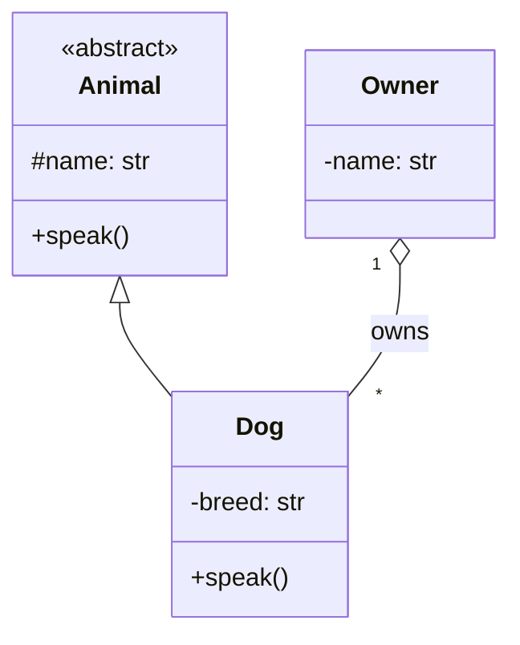
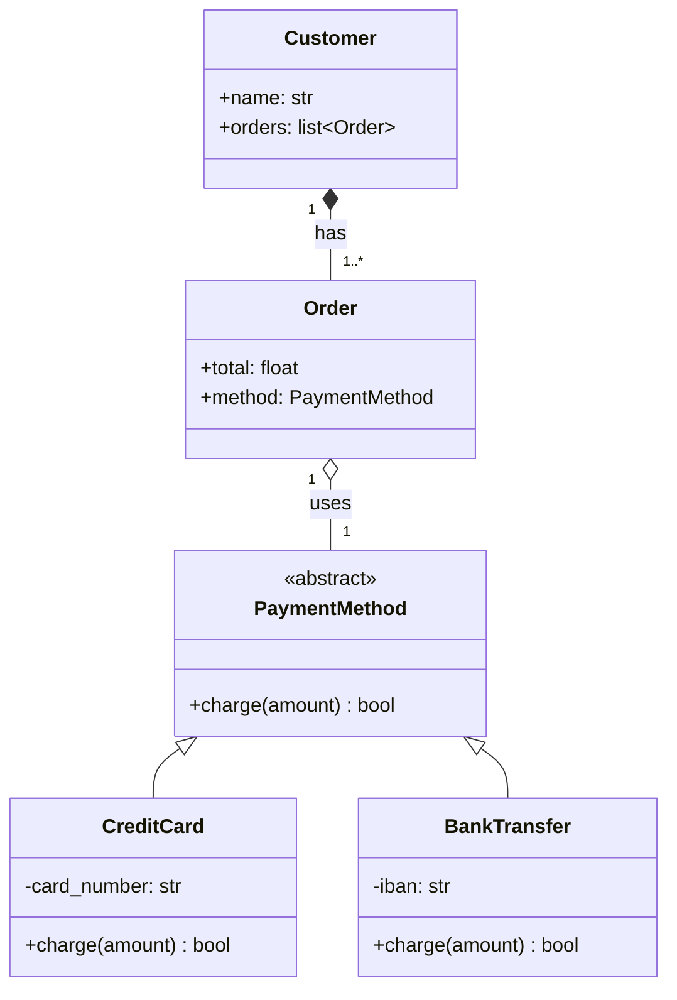

# M2 — Relations entre classes

## Objectif

À la fin de ce module, l'apprenant sera capable de :

- Distinguer les **quatre relations inter-classes** : extension (héritage), implémentation, composition, agrégation.
- Choisir la relation **adaptée au contexte** plutôt que par habitude.
- Lire et produire un **diagramme UML** des relations entre classes.
- Comprendre la notion de **namespace** (module, package, nom qualifié).
- Traduire un diagramme UML en code Python.

## Durée estimée

1 jour.

## Pré-requis

- M1 POO terminé (les 4 piliers).

---

## 1. Vue d'ensemble

### Quatre relations à connaître

Les classes ne vivent pas en isolation. Quand deux classes interagissent, leur relation tombe dans l'une des catégories suivantes :

| Relation                 | Question posée                                               | Notation UML                     |
| ------------------------ | ------------------------------------------------------------ | -------------------------------- |
| **Extension (héritage)** | "B **est-un** A ?"                                           | Flèche pleine, triangle vide     |
| **Implémentation**       | "B **respecte le contrat** A ?"                              | Flèche pointillée, triangle vide |
| **Composition**          | "A **est composé de** B (avec dépendance de cycle de vie) ?" | Losange plein                    |
| **Agrégation**           | "A **contient** B (mais B peut exister sans A) ?"            | Losange vide                     |

Une cinquième relation, la **dépendance temporaire** (méthode qui reçoit un paramètre), n'apparaît typiquement pas en UML — elle est trop éphémère.

### Pourquoi cette nuance ?

Confondre ces relations introduit des bugs subtils et de l'inertie. Exemple typique : modéliser "un Compte appartient à un Utilisateur" en composition alors que c'est une **agrégation** (un Compte peut survivre à la suppression d'un Utilisateur — ou pas, selon la politique métier). Faire le mauvais choix lie deux objets pour la vie alors qu'on voulait juste les associer.

**Analogie globale.** Les relations entre humains :

- **Extension** = parenté biologique (un enfant _est un_ humain).
- **Implémentation** = profession (médecin, avocat — engagement à des standards sans précision sur la personne).
- **Composition** = organes d'un corps (le foie ne survit pas en dehors).
- **Agrégation** = membres d'une équipe sportive (le joueur survit au départ de l'équipe).

---

## 2. Extension — héritage

### Théorie

L'extension (ou héritage) crée une **classe spécialisée** à partir d'une autre. La sous-classe :

- Hérite de tous les attributs et méthodes de la parente.
- Peut **ajouter** ses propres attributs et méthodes.
- Peut **surcharger** (override) les méthodes héritées.

Relation **"est un"** (_is-a_). `Dog` est un `Animal`. `AdminUser` est un `User`.

**Analogie.** Un enfant qui hérite des traits physiques de ses parents (yeux marron, taille) et ajoute ses propres particularités (cicatrice, accent). Il reste un humain, comme ses parents — la spécialisation ne change pas la nature.

### Démonstration

```python
class Animal:
    def __init__(self, name: str):
        self.name = name

    def describe(self) -> str:
        return f"{self.name} is an animal"


class Dog(Animal):
    def __init__(self, name: str, breed: str):
        super().__init__(name)
        self.breed = breed

    def describe(self) -> str:
        return f"{self.name} is a {self.breed} dog"


rex = Dog("Rex", "Labrador")
print(rex.describe())     # Rex is a Labrador dog
print(isinstance(rex, Animal))   # True
```

`Dog` hérite du constructeur d'`Animal` (via `super().__init__(name)`), ajoute `breed`, et redéfinit `describe()`.

### Quand utiliser l'héritage

- La relation est **vraiment** "est un" (test : peut-on substituer le child au parent partout où le parent est attendu ? — c'est le **Principe de Substitution de Liskov**, M5).
- L'héritage permet de **réutiliser du code** ET d'exploiter le **polymorphisme** (cf. M1).
- L'arbre d'héritage reste **peu profond** (3 niveaux max en pratique).

### Quand l'éviter

- Pour **uniquement réutiliser du code** — la composition est meilleure.
- Quand la relation est "a un" plutôt que "est un".
- Quand la sous-classe ne respecte pas le contrat de la parente (typique : redéfinir une méthode pour ne **rien faire**, ou lever une exception).

> **Favor composition over inheritance** — Gang of Four, 1994.

---

## 3. Implémentation — contrat sans héritage de comportement

### Théorie

L'implémentation déclare qu'une classe **respecte un contrat** défini ailleurs (interface en Java, `Protocol` ou classe abstraite en Python), sans nécessairement hériter d'aucune implémentation.

Relation **"se comporte comme"** (_behaves-as_).

**Analogie.** Un médecin et un infirmier sont liés par le **contrat professionnel** (serment d'Hippocrate, code de déontologie) — pas par leurs parents biologiques. Les deux peuvent avoir des familles totalement différentes ; ils respectent le même contrat.

### Avec une classe abstraite

```python
from abc import ABC, abstractmethod


class Serializable(ABC):
    @abstractmethod
    def to_json(self) -> str: ...


class User(Serializable):
    def __init__(self, name: str): self.name = name
    def to_json(self) -> str: return f'{{"name": "{self.name}"}}'


class Order(Serializable):
    def __init__(self, total: float): self.total = total
    def to_json(self) -> str: return f'{{"total": {self.total}}}'
```

`User` et `Order` n'ont **rien en commun** sur le plan métier, mais elles respectent le même **contrat de sérialisation**.

### Avec un `Protocol` (duck typing typé)

Python 3.8+ permet de définir un contrat sans héritage explicite :

```python
from typing import Protocol


class Serializable(Protocol):
    def to_json(self) -> str: ...


class User:                    # PAS d'héritage explicite
    def to_json(self) -> str:
        return f'{{"name": "..."}}'


def save(obj: Serializable):   # accepte tout objet ayant to_json
    write_to_disk(obj.to_json())


save(User())   # ✓ — User respecte le protocole
```

`Protocol` est l'équivalent typé du **duck typing**. La distinction interface / classe abstraite est approfondie en **M3**.

### Différence avec l'extension

| Extension                                  | Implémentation                   |
| ------------------------------------------ | -------------------------------- |
| Hérite **du code** ET du contrat           | Hérite **uniquement** du contrat |
| Relation "est un"                          | Relation "se comporte comme"     |
| Une seule classe parente (héritage simple) | Plusieurs interfaces possibles   |
| Couplage fort                              | Couplage faible                  |

---

## 4. Composition — tout/partie indissociable

### Théorie

La composition décrit une relation **forte** entre deux classes : la classe "tout" **possède** les classes "parties", et leur cycle de vie est lié. Si le tout disparaît, les parties disparaissent avec lui.

Relation **"est composé de"** (_has-a_, fort).

**Analogie.** Les organes d'un corps humain. Le foie ne survit pas en dehors du corps. Si on supprime la personne, les organes disparaissent avec elle. La composition exprime ce couplage existentiel.

### Démonstration

```python
class Engine:
    def __init__(self, power: int):
        self.power = power


class Car:
    def __init__(self, brand: str, power: int):
        self.brand = brand
        self.engine = Engine(power)        # création en interne → composition

    def __del__(self):
        # Quand Car est garbage-collected, son Engine l'est aussi
        ...
```

`Car` **crée** son `Engine` en interne. L'`Engine` n'a pas d'existence en dehors de la `Car`. Si la `Car` est détruite, l'`Engine` est détruit avec elle.

Le critère technique en Python : **l'objet "partie" est créé par l'objet "tout"** (et n'est pas exposé à l'extérieur en référence partagée).

### Notation UML

```
[Car] ◆————[Engine]
```

Losange **plein** côté Car — la possession est forte.

---

## 5. Agrégation — tout/partie indépendant

### Théorie

L'agrégation décrit une relation **plus faible** : la classe "tout" **utilise** la classe "partie", mais la partie peut exister indépendamment.

Relation **"contient mais ne possède pas"** (_has-a_, faible).

**Analogie.** Les joueurs d'une équipe sportive. L'équipe a des joueurs ; mais si l'équipe se dissout, les joueurs continuent à exister (ils rejoignent d'autres équipes). À l'inverse, un joueur peut changer d'équipe sans cesser d'exister.

### Démonstration

```python
class Player:
    def __init__(self, name: str):
        self.name = name


class Team:
    def __init__(self, name: str, players: list[Player]):
        self.name = name
        self.players = players             # liste passée en paramètre → agrégation


alice = Player("Alice")
bob = Player("Bob")

team = Team("Tigers", [alice, bob])
# Si team est supprimée, alice et bob continuent d'exister.
# alice peut être ajoutée à une autre Team.
```

`Team` **reçoit** la liste des joueurs ; elle ne les crée pas. Le critère technique : **la partie est passée en paramètre** (référence partageable).

### Notation UML

```
[Team] ◇————[Player]
                    *
```

Losange **vide** côté Team. Le `*` indique la cardinalité (plusieurs joueurs par équipe).

### Quand choisir composition vs agrégation

| Question                                                  | Composition | Agrégation                |
| --------------------------------------------------------- | ----------- | ------------------------- |
| La partie est créée en interne ?                          | Oui         | Non (passée en paramètre) |
| La partie peut-elle être partagée entre plusieurs touts ? | Non         | Oui                       |
| Si le tout disparaît, la partie disparaît-elle ?          | Oui         | Non                       |
| Cardinalité typique                                       | 1 (souvent) | 0.._, 1.._                |

### Cas limite

La distinction n'est pas toujours nette. Une voiture **a-t-elle** un moteur (composition, parce que créé avec la voiture et lié à elle) ou **utilise**-t-elle un moteur (agrégation, parce qu'on peut le remplacer) ? Les deux modélisations sont défendables — le choix dépend du domaine métier et de la politique de cycle de vie souhaitée.

---

## 6. Namespace

### Théorie

Un **namespace** est un conteneur de noms qui empêche les collisions. Sans namespace, deux classes nommées `User` venant de deux contextes différents entreraient en conflit.

En Python, les namespaces sont :

- **Module** — un fichier `.py`. `from my_pkg.users import User` qualifie `User` par son module.
- **Package** — un dossier avec `__init__.py`. Niveau supérieur de namespace.
- **Classe** — méthodes et attributs sont dans le namespace de la classe (`User.greet()`).
- **Instance** — chaque instance a son propre namespace (`user.name`).

**Analogie.** Les annuaires papier. "Jean Dupont" est ambigu, "Jean Dupont, Paris 14ème" est unique grâce au namespace géographique. Les **chemins qualifiés** rendent les noms uniques.

### Démonstration

```python
# my_app/billing/user.py
class User:
    def __init__(self, name: str):
        self.name = name
```

```python
# my_app/auth/user.py
class User:
    def __init__(self, email: str):
        self.email = email
```

```python
# main.py
from my_app.billing.user import User as BillingUser
from my_app.auth.user import User as AuthUser

b = BillingUser("Alice")
a = AuthUser("alice@x.y")
```

Les deux `User` cohabitent grâce à leurs namespaces. L'`as` permet de désambiguïser à l'import sans renommer dans le code source.

### Bonnes pratiques

- **Un concept = un module** : préférer `users/admin.py` + `users/customer.py` à un mega-fichier `users.py`.
- **Imports explicites** : `from package import X` plutôt que `from package import *`.
- **Pas de mélange de namespaces métier différents** dans un même module (auth + billing dans le même fichier = mauvais signe).

---

## 7. Lecture / écriture d'un diagramme UML

### Pourquoi UML ?

Pour **dialoguer** sur la structure d'un code sans avoir à le lire. Un diagramme UML capture les classes, leurs attributs, leurs méthodes, et surtout leurs **relations**.

L'objectif n'est pas la perfection notationnelle — c'est la **clarté pour l'équipe**.

### Notation des relations

```
A ──▷ B    : A étend B (héritage)         — triangle vide, ligne pleine
A ┄▷ B     : A implémente l'interface B   — triangle vide, ligne pointillée
A ◆── B    : A est composé de B           — losange plein côté A
A ◇── B    : A agrège B                    — losange vide côté A
A ──→ B    : A utilise B (dépendance)     — flèche simple
```

### Notation des classes

```
┌─────────────────┐
│   ClassName     │
├─────────────────┤
│ + public_attr   │
│ - private_attr  │
│ # protected     │
├─────────────────┤
│ + public_method │
│ - private_method│
└─────────────────┘
```

`+` = public, `-` = privé, `#` = protégé. (Convention historique Java/C++ ; en Python, on traduit par `_` et `__`.)

### Exemple complet

```
┌──────────────────┐
│   Animal         │
│   (abstract)     │
├──────────────────┤
│ # name : str     │
├──────────────────┤
│ + speak()        │
└────────△─────────┘
         │ extends
         │
┌────────┴─────────┐         ┌──────────────┐
│      Dog         │         │   Owner      │
├──────────────────┤  ◇─────│              │
│ - breed : str    │   *    ├──────────────┤
├──────────────────┤         │ - name : str │
│ + speak()        │         └──────────────┘
└──────────────────┘         (un Owner agrège
                              plusieurs Dogs)
```

### Outils

- **PlantUML** — syntaxe textuelle, génération d'images. Versionable en Git.
- **draw.io / diagrams.net** — éditeur visuel gratuit.
- **Mermaid** — embed dans Markdown, supporté par GitHub.

Exemple Mermaid (rendable dans VS Code, GitLab, GitHub) :



---

## 8. Exercices pratiques

### Exercice 1 — Identifier la relation (≈ 20 min)

Pour chaque snippet, identifier la relation principale et la justifier :

```python
# Cas A
class Bird:
    def fly(self): print("flap")

class Penguin(Bird):
    def fly(self): raise NotImplementedError("Penguins can't fly")
```

```python
# Cas B
class Heart:
    def beat(self): print("thump")

class Person:
    def __init__(self):
        self.heart = Heart()
```

```python
# Cas C
class Book:
    def __init__(self, title): self.title = title

class Library:
    def __init__(self, books: list[Book]):
        self.books = books
```

```python
# Cas D
from typing import Protocol

class Drawable(Protocol):
    def draw(self): ...

class Circle:
    def draw(self): print("○")
```

### Exercice 2 — Refactor héritage → composition (≈ 30 min)

Soit la classe `Stack` ci-dessous (héritage de `list`) :

```python
class Stack(list):
    def push(self, item):
        self.append(item)

    def pop_top(self):
        return self.pop()
```

Problèmes :

- `Stack` hérite de tout `list` (insertion arbitraire, slice, etc.) — ce n'est pas ce qu'on veut.
- Encapsulation cassée.

Refactorer en **composition** :

```python
class Stack:
    def __init__(self):
        self._items: list = []
    # ...
```

### Exercice 3 — Composition vs Agrégation (≈ 30 min)

Implémenter `Engine` et `Car` deux fois :

1. **Composition** : `Car` crée son `Engine` en interne (paramètres : `power`).
2. **Agrégation** : `Car` reçoit un `Engine` en paramètre (peut être partagé avec d'autres voitures).

Pour chaque version, écrire un mini-test démontrant le comportement attendu (mêmes engine partagé en agrégation, engine isolé en composition).

### Exercice 4 — UML → code (≈ 35 min)

Traduire ce diagramme Mermaid en code Python :



Identifier quelles relations sont composition et lesquelles sont agrégation, puis implémenter en Python.

### Exercice 5 — Namespace propre (≈ 25 min)

Soit un module `models.py` qui contient `User`, `Order`, `Product`, `Invoice`, `Address`, `Cart`, `PaymentMethod`, `CreditCard`, `BankTransfer`.

Refactorer en plusieurs modules organisés par domaine :

```
my_app/
├── users.py         # User, Address
├── orders.py        # Order, Cart
├── products.py      # Product
├── billing/
│   ├── __init__.py
│   ├── invoice.py
│   └── payment.py   # PaymentMethod, CreditCard, BankTransfer
```

Mettre à jour les imports en conséquence. Vérifier qu'on peut faire :

```python
from my_app.users import User
from my_app.billing.payment import CreditCard
```

---

## 9. Mini-défi de synthèse (≈ 2 heures)

Modéliser un **système de gestion de cours d'apprentissage** (méta-projet : Noledj lui-même !).

**Domaine** :

- Un **Cours** appartient à une **Compétence**.
- Un **Cours** est composé de **Modules** (le cours possède ses modules — composition).
- Un **Module** contient des **Exercices** (composition).
- Une **Compétence** peut être référencée par plusieurs **Apprenants** qui la suivent (agrégation).
- Un **Apprenant** a un **Profil** (composition) et **plusieurs Compétences en cours** (agrégation).
- **Compétence**, **Apprenant**, **Profil** doivent tous implémenter un protocole **Serializable** (méthode `to_dict() -> dict`).

**Livrables** :

1. Un **diagramme UML** (Mermaid ou ASCII) en commentaire en haut du fichier.
2. Le **code Python** correspondant, respectant chaque relation.
3. Un **test de scénario** : créer un Apprenant avec 2 Compétences, dont une partagée avec un autre Apprenant. Supprimer une Compétence du premier Apprenant — vérifier que le second Apprenant l'a toujours.

**Validation** :

- [ ] Chaque relation entre classes est explicite et justifiée (composition vs agrégation, héritage vs implémentation).
- [ ] L'organisation en namespaces est propre (1 dossier `noledj_model/` contenant les sous-modules `cours.py`, `competence.py`, `apprenant.py`, etc.).
- [ ] Le test prouve qu'une compétence partagée (agrégation) survit à la suppression d'un Apprenant.

---

## 10. Auto-évaluation

Le module M2 est validé lorsque :

- [ ] L'apprenant peut citer 4 types de relations entre classes et donner une analogie pour chacune.
- [ ] Il distingue **composition** et **agrégation** sur un cas donné, et peut justifier.
- [ ] Il distingue **extension** et **implémentation** et choisit la bonne selon le contexte.
- [ ] Il sait lire et produire un diagramme UML basique (Mermaid ou équivalent).
- [ ] Il organise un projet en namespaces / modules propres.
- [ ] Le mini-défi est implémenté avec un diagramme UML et un test validant l'agrégation.

**Items du glossaire visés** (vers passage P/N → A) :

- **N2** : liens entre classes (extension, implémentation, composition, agrégation), namespace.

---

## 11. Ressources complémentaires

- **Erich Gamma et al.** — _Design Patterns: Elements of Reusable Object-Oriented Software_ (1994), chapitre 1 sur les principes de conception.
- **Martin Fowler** — _UML Distilled_, court livre de référence sur l'UML pratique.
- **Documentation Python** — _Modules_ et _Packages_ : [docs.python.org/3/tutorial/modules.html](https://docs.python.org/3/tutorial/modules.html).
- **PlantUML** : [plantuml.com](https://plantuml.com) — diagrammes UML en syntaxe textuelle.
- **Mermaid** : [mermaid.js.org](https://mermaid.js.org) — diagrammes embarquables dans Markdown.
- **Real Python** — _Object-Oriented Programming (OOP) in Python 3_, section sur l'héritage et la composition.
